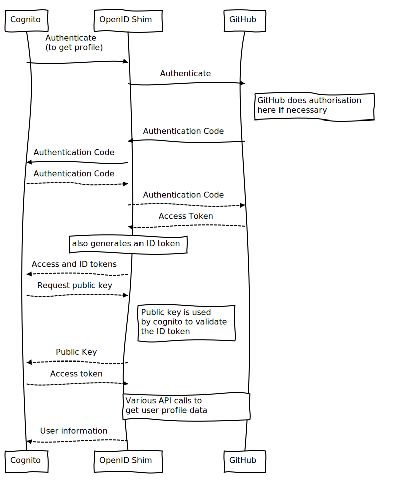

# GitHub OpenID Connect Wrapper for Cognito

[](https://travis-ci.org/TimothyJones/github-cognito-openid-wrapper)
[](https://codeclimate.com/github/TimothyJones/github-openid-wrapper/maintainability)
[](https://codeclimate.com/github/TimothyJones/github-openid-wrapper/test_coverage)
[](https://snyk.io/test/github/TimothyJones/github-cognito-openid-wrapper?targetFile=package.json)
[](https://opensource.org/licenses/BSD-3-Clause)


Do you want to add GitHub as an OIDC (OpenID Connect) provider to an AWS Cognito User Pool? Have you run in to trouble because GitHub only provides OAuth2.0 endpoints, and doesn't support OpenID Connect?

This project allows you to wrap your GitHub OAuth App in an OpenID Connect layer, allowing you to use it with AWS Cognito.

Here are some questions you may immediately have:

- **Why does Cognito not support federation with OAuth?** Because OAuth provides
  no standard way of requesting user identity data. (see the [background](#background)
  section below for more details).

- **Why has no one written a shim to wrap general OAuth implementations with an
  OpenID Connect layer?** Because OAuth provides no standard way of requesting
  user identity data, any shim must be custom written for the particular OAuth
  implementation that's wrapped.

- **GitHub is very popular, has someone written this specific custom wrapper
  before?** As far as I can tell, if it has been written, it has not been open
  sourced. Until now!

## Project overview

When deployed, this project sits between Cognito and GitHub:


This allows you to use GitHub as an OpenID Identity Provider (IdP) for federation with a Cognito User Pool.

The project implements everything needed by the [OIDC User Pool IdP authentication flow](https://docs.aws.amazon.com/cognito/latest/developerguide/cognito-user-pools-oidc-flow.html) used by Cognito.

It implements the following endpoints from the
[OpenID Connect Core Spec](https://openid.net/specs/openid-connect-core-1_0.html):

- Authorization - used to start the authorisation process ([spec](https://openid.net/specs/openid-connect-core-1_0.html#AuthorizationEndpoint))
- Token - used to exchange an authorisation code for an access and ID token ([spec](https://openid.net/specs/openid-connect-core-1_0.html#TokenEndpoint))
- UserInfo - used to exchange an access token for information about the user ([spec](https://openid.net/specs/openid-connect-core-1_0.html#UserInfo))
- jwks - used to describe the keys used to sign ID tokens ([implied by spec](https://openid.net/specs/openid-connect-discovery-1_0.html#ProviderMetadata))

It also implements the following [OpenID Connect Discovery](https://openid.net/specs/openid-connect-discovery-1_0.html) endpoint:

- Configuration - used to discover configuration of this OpenID implementation's
  endpoints and capabilities. ([spec](https://openid.net/specs/openid-connect-discovery-1_0.html#ProviderConfig))

Out of the box, you can deploy it as a CloudFormation stack, or run it as a web server with node.

## Getting Started

This project is intended to be deployed as a series of lambda functions alongside
an API Gateway. This means it's easy to use in conjunction with Cognito, and
should be cheap to host and run.

You can also deploy it as a http server running as a node app. This is useful
for testing, exposing it to Cognito using something like [ngrok](https://ngrok.com/).

### 1: Setup

You will need to:

- Create a Cognito User Pool ([instructions](https://docs.aws.amazon.com/cognito/latest/developerguide/cognito-user-pool-as-user-directory.html)).
- Configure App Integration for your User Pool ([instructions](https://docs.aws.amazon.com/cognito/latest/developerguide/cognito-user-pools-configuring-app-integration.html)). Note down the domain name.
- Create a GitHub OAuth App ([instructions](https://developer.github.com/apps/building-oauth-apps/creating-an-oauth-app/), with the following settings:
  - Authorization callback URL: `https://<Your Cognito Domain>/oauth2/idpresponse`
  - Note down the Client ID and secret

(If you use GitHub Enterprise, you need the API & Login URL. This is usually `https://<GitHub Enterprise Host>/api/v3` and `https://<GitHub Enterprise Host>`.)

Next you need to decide if you'd like to deploy with lambda/API Gateway (follow Step 2a), or as a node server (follow Step 2b)

### 2a: Deployment with lambda and API Gateway

- Install the `aws` and `sam` CLIs from AWS:

  - `aws` ([install instructions](https://docs.aws.amazon.com/cli/latest/userguide/installing.html)) and configured
  - `sam` ([install instructions](https://docs.aws.amazon.com/lambda/latest/dg/sam-cli-requirements.html))

- Run `aws configure` and set appropriate access keys etc
- Set environment variables for the OAuth App client/secret, callback url, stack name, etc:

       cp example-config.sh config.sh
       vim config.sh # Or whatever your favourite editor is

- Run `npm install` and `npm run deploy`
- Note down the DNS of the deployed API Gateway (available in the AWS console).

### 2b: Running the node server

- Set environment variables for the OAuth App client/secret, callback url, and
  port to run the server on:

       cp example-config.sh config.sh
       vim config.sh # Or whatever your favourite editor is

- Source the config file:

```
  source config.sh
```

- Run `npm run start` to fire up an auto-refreshing development build of the
  server (production deployment is out of scope for this repository, but you can expose it using something like [ngrok](https://ngrok.com/) for easy development and testing with Cognito).

### 3: Finalise Cognito configuration

- Configure the OIDC integration in AWS console for Cognito (described below, but following [these instructions](https://docs.aws.amazon.com/cognito/latest/developerguide/cognito-user-pools-oidc-idp.html)). The following settings are required:
  - Client ID: The GitHub Client ID above
  - Authorize scope: `openid read:user user:email`
  - Issuer: either `https://<Your API Gateway DNS name>/Prod` (for lambda with API gateway, replace `Prod` with the correct stage name) or `https://<your webserver>/` (for the node server).
  - If you have deployed the web app: Run discovery (big blue button next to Issuer).
  - If you have deployed the lambda/Gateway: For some reason, Cognito is unable to
    do OpenID Discovery. You will need to configure the endpoints manually. They are:
    - Authorization endpoint: `https://<Your API Gateway DNS name>/Prod/authorize`
    - Token endpoint: `https://<Your API Gateway DNS name>/Prod/token`
    - Userinfo endpoint: `https://<Your API Gateway DNS name>/Prod/userinfo`
    - JWKS uri: `https://<Your API Gateway DNS name>/Prod/.well-known/jwks.json`
- Configure the Attribute Mapping in the AWS console:


- Ensure that your new provider is enabled under **Enabled Identity Providers** on the App Client Settings screen under App Integration.

That's it! If you need to redeploy the lambda/API gateway solution, all you need to do is run `npm run deploy` again.

## The details

### Background

There are two important concepts for identity federation:

- Authentication: Is this user who they say they are?
- Authorisation: Is the user allowed to use a particular resource?

#### OAuth

[OAuth2.0](https://tools.ietf.org/html/rfc6749) is an _authorisation_ framework,
used for determining whether a user is allowed to access a resource (like
private user profile data). In order to do this, it's usually necessary for
_authentication_ of the user to happen before authorisation.

This means that most OAuth2.0 implementations (including GitHub) [include authentication in a step of the authorisation process](https://medium.com/@darutk/new-architecture-of-oauth-2-0-and-openid-connect-implementation-18f408f9338d).
For all practical purposes, most OAuth2.0 implementations (including GitHub)can
be thought of as providing both authorisation and authentication.

Below is a diagram of the authentication code flow for OAuth:


(The solid lines are http requests from the browser, and then dashed lines are
back-channel requests).

As you can see in the diagram, a drawback of OAuth is that it provides no
standard way of finding out user data such as name, avatar picture, email
address(es), etc. This is one of the problems that is solved by OpenID.

#### OpenID Connect

To provide a standard way of learning about users,
[OpenID Connect](https://openid.net/connect/) is an identity layer built on top
of OAuth2.0. It extends the `token` endpoint from OAuth to include an ID Token
alongside the access token, and provides a `userinfo` endpoint, where information
describing the authenticated user can be accessed.


OpenID Connect describes a standard way to get user data, and is therefore a good choice
for identity federation.

### A custom shim for GitHub

This project provides the OpenID shim to wrap GitHub's OAuth implementation, by combining the two
diagrams:



The userinfo request is handled by joining two GitHub API requests: `/user` and `/user/emails`.

You can compare this workflow to the documented Cognito workflow [here](https://docs.aws.amazon.com/cognito/latest/developerguide/cognito-user-pools-oidc-flow.html)

#### Code layout

    ├── scripts             # Bash scripts for deployment and key generation
    ├── src                 # Source code
    │    ├── __mocks__      # Mock private key data for tests
    │    └── connectors     # Common code for both lambda and web handlers
    │         ├── lambda    # AWS lambda handlers
    │         │    └── util # Helper functions for lambdas
    │         └── web       # Express.js webserver (useful for local deployment)
    ├── docs                # Documentation images
    ├── config              # Configuration for tests
    ├── dist-web            # Dist folder for web server deployment
    └-- dist-lambda         # Dist folder for lambda deployment

#### npm targets

- `build` and `build-dist`: create packages in the `dist-lambda` folder (for the lambda
  deployment) and the `dist-web` folder (for the node web server).
- `test`: Run unit tests with Jest
- `lint`: Run `eslint` to check code style
- `test-dev`: Run unit tests continuously, watching the file system for changes
  (useful for development)
- `deploy`: This script builds the project, then creates and deploys the
  cloudformation stack with the API gateway and the endpoints as lambdas

#### Scripts

- `scripts/create-key.sh`: If the private key is missing, generate a new one.
  This is run as a preinstall script before `npm install`
- `scripts/deploy.sh`: This is the deploy part of `npm run deploy`. It uploads
  the dist folder to S3, and then creates the cloudformation stack that contains  
  the API gateway and lambdas

#### Tests

Tests are provided with [Jest](https://jestjs.io/) using
[`chai`'s `expect`](http://www.chaijs.com/api/bdd/), included by a shim based on [this blog post](https://medium.com/@RubenOostinga/combining-chai-and-jest-matchers-d12d1ffd0303).

[Pact](http://pact.io) consumer tests for the GitHub API connection are provided
in `src/github.pact.test.js`. There is currently no provider validation performed.

#### Private key

The private key used to make ID tokens is stored in `./jwtRS256.key` once
`scripts/create-key.sh` is run (either manually, or as part of `npm install`).
You may optionally replace it with your own key - if you do this, you will need
to redeploy.

#### Missing features

This is a near-complete implementation of [OpenID Connect Core](https://openid.net/specs/openid-connect-core-1_0.html).
However, since the focus was on enabling Cognito's [authentication flow](https://docs.aws.amazon.com/cognito/latest/developerguide/cognito-user-pools-oidc-flow.html),
you may run in to some missing features if you wish to use it with a different
client.

**Missing Connect Core Features:**

- Private key rotation ([spec](https://openid.net/specs/openid-connect-core-1_0.html#RotateSigKeys))
- Refresh tokens ([spec](https://openid.net/specs/openid-connect-core-1_0.html#RefreshTokens))
- Passing request parameters as JWTs ([spec](https://openid.net/specs/openid-connect-core-1_0.html#JWTRequests))

If you don't know what these things are, you are probably ok to use this project.

**Missing non-core features:**

A full OpenID implementation would also include:

- [The Dynamic client registration spec](https://openid.net/specs/openid-connect-registration-1_0.html)
- The [OpenID Connect Discovery](https://openid.net/specs/openid-connect-discovery-1_0.html) endpoints beyond `openid-configuration`

**Known issues**

none

## Extending

This section contains pointers if you would like to extend this shim.

### Using other OAuth providers

If you want to use a provider other than GitHub, you'll need to change the contents of `userinfo` in `src/openid.js`.

### Using a custom GitHub location

If you're using an on-site GitHub install, you will need to change the API
endpoints used when the `github` object is initialised.

### Including additional user information

If you want to include custom claims based on other GitHub data,
you can extend `userinfo` in `src/openid.js`. You may need to add extra API
client calls in `src/github.js`

## Contributing

Contributions are welcome, especially for the missing features! Pull requests and issues are very welcome.

## FAQ

### How do I use this to implement Cognito logins in my app?

Login requests from your app go directly to Cognito, rather than this shim.
This is because the shim sits only between Cognito and GitHub, not between your
app and GitHub. See the [Cognito app integration instructions](https://docs.aws.amazon.com/cognito/latest/developerguide/cognito-user-pools-app-integration.html)
for more details.

### Can I use this shim to connect to GitHub directly from another OpenID client?

Yes. This implementation isn't complete, as it focusses exclusively on 
Cognito's requirements. However, it does follow the OpenID spec, and is
complete enough to be able to use it as an OpenID connect provider. See the
missing features section above for one or two caveats.

### How do I contact you to tell you that I built something cool with this code?

If you build anything cool, ping me [@JonesTim](https://twitter.com/JonesTim) on
twitter (or open an issue if you have any problems).

## License

[BSD 3-Clause License](LICENSE)
